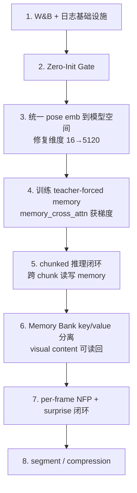

# LingBot 超时空记忆修复评审与 W&B 训练观测方案

## 1. 结论摘要

当前代码还没有正确实现你想要的 `Cambrian-S Surprise + WorldMem Memory Bank` 闭环。

核心原因不是"模块没写"，而是"闭环没有打通"：

- 推理没有真正的跨 `chunk` 读写循环
- 训练阶段没有让 `memory_cross_attn` 真正参与 forward 并获得梯度
- 检索没有使用真实几何对齐的 `pose/state`
- Memory Bank 还没有把"视觉内容"和"状态"同时作为可读回的记忆
- `LFP + Surprise` 训练目标和推理写入策略没有闭环
- Memory 注入分支缺少 zero-init gate，随机初始化参数直接累加到预训练隐藏状态上

所以，当前版本更接近：

- 已经搭好了 `MemoryBank / MemoryCrossAttention / NFPHead / WanModelWithMemory`
- 但是还没有变成一套可以稳定训练、稳定推理、稳定对比实验的完整系统

---

## 2. 当前阻塞问题

### P0-A. 推理没有形成跨 chunk 闭环

当前 `infer_v2.py` 只会：

1. 创建空的 `MemoryBank`
2. 在生成前尝试检索（bank 必然为空 → `memory_states=None`）
3. 调用**一次** `generate()`
4. 生成完成后更新 bank
5. 退出

这意味着：

- 第一段生成时 bank 为空，memory 分支被跳过
- 写入发生在生成完成后
- 没有"下一段生成前读取上一段记忆"的过程
- 你描述的"下一段 chunk 用当前位姿去 top-K 检索上一段记忆"现在**根本没有跑起来**

代码证据：

- `infer_v2.py:L404-446`：整个 memory 路径只有一次 generate → 一次 update → 退出
- `infer_v3.py:L12-15`：`raise NotImplementedError`

### P0-B. Stage1 实际没有训练到 memory attention

`train_v2_stage1.py` 里虽然 `freeze_for_stage()` 解冻了：

- `memory_cross_attn`
- `memory_norm`
- `nfp_head`

但是训练 forward 明确传了：

```python
# train_v2_stage1.py:L733
memory_states=None,
```

而 `MemoryBlockWrapper.forward()` 里的判断逻辑是：

```python
# model_with_memory.py:L105
if dit_cond_dict is not None and _MEMORY_STATES_KEY in dit_cond_dict:
    # 只有这个分支才执行 memory_cross_attn
```

所以 Stage1 实际上：

- `memory_cross_attn` 的 Q/K/V/O Linear 层**没有参与计算图**，无梯度流过
- `memory_norm` 同理，**没有参与计算图**
- 真正能学到的**只剩 `nfp_head`**（通过 forward hook 从最后一层 block 捕获 hidden states）
- optimizer 对 `memory_cross_attn` 和 `memory_norm` 只执行 weight decay，不会学到有意义的东西

### P0-C. 当前检索向量维度和语义都不对

`infer_v2.py` 现在写入 bank 的 `pose_emb` 是：

```python
# infer_v2.py:L326
pose_emb = latent[:, t].mean(dim=(-2, -1)).cpu()  # [z_dim=16]
```

这是 `z_dim=16` 的 latent 通道均值。

但 `MemoryCrossAttention` 的 K/V 线性层要求的是模型隐藏维 `dim=5120`：

```python
# memory_attention.py:L85-86
self.k = nn.Linear(dim, dim, bias=False)  # dim=5120
self.v = nn.Linear(dim, dim, bias=False)  # dim=5120
```

**输入 16 维到 Linear(5120, 5120) 会直接 `RuntimeError: mat1 and mat2 shapes cannot be multiplied`。**

同时检索 query 当前是全零向量：

```python
# infer_v2.py:L413
query_emb = torch.zeros(query_dim, device=device)
```

零向量的 cosine similarity 在 PyTorch 中（因为 eps 兜底）对所有 key 返回 `0.0`，`topk` 排序退化为按存储顺序取前 K 个，**没有任何语义检索能力**。

仓库里已经有正确的模型空间 pose 投影函数 `get_projected_frame_embs()`（`model_with_memory.py:L221-258`），但当前推理**没有使用它**。

### P0-D. Memory 注入缺少 Zero-Init Gate

WorldMem 参考实现中，memory block 使用了 **adaLN gate**（`r_gate_msa`），且 `r_adaLN_modulation` 的最后一层权重被初始化为零：

```python
# WorldMem dit.py:L269
r_shift_msa, r_scale_msa, r_gate_msa, ... = self.r_adaLN_modulation(c).chunk(6, dim=-1)
# WorldMem dit.py:L304
x = x + gate(self.r_attn(...), r_gate_msa)  # gate 初始为 0，memory 分支初始不影响主干

# WorldMem dit.py:L457-459（初始化）
if self.use_plucker and self.use_memory_attention:
    nn.init.constant_(block.pose_cond_mlp.weight, 0)
    nn.init.constant_(block.pose_cond_mlp.bias, 0)
```

你的实现**直接做了残差加法**，没有 gate：

```python
# model_with_memory.py:L107
x = x + self.memory_cross_attn(self.memory_norm(x), memory_states)
```

**影响**：随机初始化的 `memory_cross_attn` 输出非零随机值，直接加到预训练模型的 5120 维隐藏状态上。在 40 个 DiT blocks 中每个都叠加一个随机扰动，累积效果可能导致训练初期严重不稳定或模型输出坍塌。

### P1-A. Memory Bank 还不是 WorldMem 风格

现在 `MemoryFrame` 虽然存了：

- `pose_emb`
- `latent`
- `surprise_score`
- `timestep`

但 `retrieve()` 只返回 `pose_emb`：

```python
# memory_bank.py:L157-159
memory_states = torch.stack(
    [self.frames[i].pose_emb for i in indices.tolist()]
).to(device)  # [k, dim]
```

也就是说当前 memory attention 实际读回的是一个历史位姿代理向量，**而不是历史视觉内容 + 历史状态**。`MemoryFrame.latent` 存了但**从未被任何 retrieve 路径读取**。

这和你想要的 WorldMem 设计有本质差距。WorldMem 中 memory attention 的 KV 是 **visual hidden states + pose conditioning** 的完整特征（`dit.py:L295-298`：`attn_input = input_cond + x`），不只是位姿向量。

### P1-B. Surprise 训练目标和推理写入策略未闭环

**训练时**，`NFPHead` 的预测方式是：

```python
# nfp_head.py:L77
x = hidden_states.mean(dim=1)  # 全序列 mean-pool → [B, dim]
# MLP → [B, z_dim=16]
```

预测目标是：

```python
# train_v2_stage1.py:L751
actual_latent = video_latent.mean(dim=[-3, -2, -1]).unsqueeze(0)  # [1, 16]
```

这里 `video_latent` shape 为 `[16, lat_f, lat_h, lat_w]`（无 batch 维），`.mean(dim=[-3, -2, -1])` 对 `lat_f × lat_h × lat_w` 三个维度做均值，得到 `[16]`。这是**整段视频在时空上的全局均值**，不是"下一帧"的 latent。

NFP 的设计意图（参考 Cambrian-S）是"预测**下一帧**的视觉特征，预测失败说明该帧有惊奇"。但当前实现：

- 训练学的是 **clip-level 全局代理**（隐藏状态全局均值 → 视频 latent 全局均值）
- 推理写入用的是 **frame-level heuristic**（`1 - cosine_sim(latent[t-1], latent[t])`）
- 两者完全无关联

所以现在并不能实现"由 LFP 决定哪些帧值得写入"。

### P1-C. `from_wan_model` 双次初始化 14B 参数

`from_wan_model()` 的工作流是：

```python
# model_with_memory.py:L285-303
model = cls(...)  # 创建全新的 WanModelWithMemory → 初始化 14B 参数
# ...
model.load_state_dict(remapped_sd, strict=False)  # 覆盖刚初始化的参数
```

对于 14B 模型，第一次 `cls(...)` 会在 GPU 上创建并初始化所有参数，然后 `load_state_dict` 再全部覆盖。这意味着：

- 峰值内存 = base_model 参数 + 新模型参数 + remapped state_dict ≈ 3× 模型大小
- 在 A100-80G 上可能刚好不 OOM，但在较小显存上会失败

建议使用 `meta` device 创建新模型再 `load_state_dict`，或直接在 `from_wan_model` 中就地修改 `base_model` 的 blocks。

### P2. Cambrian-S 风格的事件分段和压缩没有实现

目前 Memory Bank 的策略只是容量满后替换最低 surprise。还没有：

- 低 surprise 片段压缩
- 段级 merge
- 惊奇驱动的事件分段
- 基于 segment 的写入预算

---

## 3. 修复优先级

## 3.1 P0：必须先修

### 任务 A：把推理改成真正的 chunked memory rollout

目标：

- 第一段生成后写入 memory
- 第二段生成前读取 memory
- 第三段继续沿用更新后的 memory
- 直到整段 episode 结束

修复 sketch：

```python
# infer_v2.py 新增 generate_chunked_episode()
def generate_chunked_episode(pipeline, bank, chunks, model, device):
    """按 chunk 组织 episode，形成跨 chunk 记忆闭环。"""
    all_videos = []
    for chunk_idx, chunk in enumerate(chunks):
        # 1. 计算当前 chunk 的 query pose embedding（真实位姿）
        c2ws_plucker_emb = build_dit_cond_dict(
            chunk.poses, chunk.actions, chunk.intrinsics)
        query_emb = model.get_projected_frame_embs(
            c2ws_plucker_emb["c2ws_plucker_emb"][0])  # [lat_f, dim]
        query = query_emb.mean(dim=0)  # [dim]

        # 2. 从 bank 检索 top-K
        memory_states = bank.retrieve(query, top_k=4, device=device)
        if memory_states is not None:
            memory_states = memory_states.unsqueeze(0)  # [1, K, dim]

        # 3. 注入 memory 并生成
        _patch_pipeline_memory(pipeline, memory_states)
        video = pipeline.generate(...)
        _unpatch_pipeline_memory(pipeline)

        # 4. 用 NFPHead + get_projected_frame_embs 更新 bank
        _update_memory_bank_from_projected_embs(
            bank, video, model, pipeline, device,
            chunk_start_frame=chunk_idx * frames_per_chunk)

        all_videos.append(video)
    return all_videos
```

最低验收标准：

- 第 2 个 chunk 开始，`memory_bank.size() > 0`
- 第 2 个 chunk 开始，`memory_states is not None`
- 日志中能看到每个 chunk 的 bank size、retrieved K、retrieval similarity

### 任务 B：训练时必须让 memory attention 真进图

目标：

- Stage1 不只是训 `nfp_head`
- `memory_cross_attn` 在训练时必须参与 forward 并获得梯度

修复 sketch（teacher-forced memory）：

```python
# train_v2_stage1.py training_step 中
# 用前半 chunk 的 pose embedding 构造 memory_states
with torch.no_grad():
    c2ws_plucker_emb_tensor = dit_cond_dict["c2ws_plucker_emb"][0]  # [1, C, lat_f, lat_h, lat_w]
    frame_embs = model.get_projected_frame_embs(c2ws_plucker_emb_tensor)  # [lat_f, dim]

    # 前 burnin_frames 帧作为 memory source
    burnin = min(args.memory_train_burnin_frames, frame_embs.shape[0] // 2)
    memory_states = frame_embs[:burnin].unsqueeze(0)  # [1, burnin, dim]

# 生成时注入 teacher-forced memory
pred = model(
    [noisy_latent], t=t, context=context, seq_len=seq_len,
    y=[y], dit_cond_dict=dit_cond_dict,
    memory_states=memory_states,  # 不再是 None
)
```

最低验收标准：

- `memory_cross_attn.q/k/v/o` 的 grad norm 非零
- `memory_norm` 的 grad norm 非零
- W&B 中可以看到 `grad/memory_cross_attn_*` 曲线

### 任务 C：把 pose query / memory key 统一到模型空间

目标：

- 写入和检索都使用 `get_projected_frame_embs()` 产生的模型空间嵌入（`[dim=5120]`）
- 不再使用 `latent.mean()` 作为 `pose_emb`（`z_dim=16`）
- 不再使用零向量 query

修复位置：

- `infer_v2.py:_update_memory_bank()` → 替换 `latent[:, t].mean(dim=(-2, -1))` 为 `get_projected_frame_embs()` 的逐帧输出
- `infer_v2.py:L413` → 替换 `torch.zeros(query_dim)` 为当前 chunk 的真实 frame embedding

最低验收标准：

- `memory_states.shape[-1] == model.dim`（即 5120，不是 16）
- `retrieve()` 的输入输出维度稳定
- 不再依赖零向量 query

### 任务 D：添加 Zero-Init Gate

修复 sketch：

```python
# model_with_memory.py MemoryBlockWrapper.__init__
self.memory_gate = nn.Parameter(torch.zeros(1))  # 初始为 0

# model_with_memory.py MemoryBlockWrapper.forward
if dit_cond_dict is not None and _MEMORY_STATES_KEY in dit_cond_dict:
    memory_states = dit_cond_dict[_MEMORY_STATES_KEY]
    x = x + self.memory_gate * self.memory_cross_attn(
        self.memory_norm(x), memory_states)
```

这样初始化时 `memory_gate=0`，memory 分支输出被消除，不破坏预训练权重行为。训练过程中 gate 值逐渐增大，memory 信号逐渐接入。

**替代方案**：zero-init `memory_cross_attn.o.weight`（`nn.init.zeros_(self.memory_cross_attn.o.weight)`），效果类似但更简洁。

## 3.2 P1：随后修

### 任务 E：把 Memory Bank 改成真正的 visual content + state

建议把单条 memory 拆成：

- `state_key`：pose embedding（`[dim]`），用于检索排序
- `value_visual`：对应帧的 DiT hidden state 或投影后的 latent（`[dim]`），用于 cross-attention 的 Value
- `meta`：surprise_score、timestep、chunk_id、age

建议接口：

```python
bank.update(
    key_state=frame_emb,         # [dim], 用于 cosine检索
    value_visual=hidden_state,   # [dim], 用于 cross-attn value
    surprise_score=surprise,
    timestep=t,
    chunk_id=chunk_idx,
)

result = bank.retrieve(query, top_k=K)
# result.keys: [K, dim]  → cross-attn Key
# result.values: [K, dim] → cross-attn Value
# result.timesteps: [K]
# result.surprises: [K]
```

`MemoryCrossAttention` 对应修改：

```python
def forward(self, x, memory_keys, memory_values, memory_lens=None):
    q = self.norm_q(self.q(x))         # Query 来自当前帧
    k = self.norm_k(self.k(memory_keys))   # Key 来自历史 pose
    v = self.v(memory_values)              # Value 来自历史视觉
    out = flash_attention(q, k, v, k_lens=memory_lens)
    return self.o(out.flatten(2))
```

### 任务 F：让 Surprise 变成真正的 per-frame 写入信号

当前问题的精确分析：

- `NFPHead.forward()` 对全序列 `hidden_states.mean(dim=1)` → clip-level 向量
- Cambrian-S 原始设计是 **per-token** 预测下一 visual token 的特征

修复方案：

```python
# nfp_head.py 新增 per-frame 预测
def forward_per_frame(self, hidden_states, grid_sizes):
    """从 [B, L, dim] 重排回 [B, lat_f, spatial, dim]，逐帧预测。"""
    lat_f = grid_sizes[0, 0].item()
    h_p = grid_sizes[0, 1].item()
    w_p = grid_sizes[0, 2].item()
    # [B, lat_f * h_p * w_p, dim] → [B, lat_f, h_p*w_p, dim]
    x = hidden_states.view(-1, lat_f, h_p * w_p, self.dim)
    # 逐帧 spatial pool → [B, lat_f, dim]
    x = x.mean(dim=2)
    # MLP → [B, lat_f, z_dim]
    return self.mlp(x)
```

训练目标改为逐帧的下一帧 latent：

```python
# target: video_latent[:, t+1].mean(dim=(-2,-1)) for each frame t
# 最后一帧没有 target → loss_mask[-1] = 0
```

### 任务 G：加入段级事件分段与压缩

建议的最小版本：

- 连续低 surprise 帧先缓存在 short-term buffer
- 当遇到高 surprise 或段落结束时：
  - 将低 surprise 段压缩成 1 个 summary memory（均值池化 key + value）
  - 将高 surprise 关键帧单独写入 bank
- 满容量时不只是丢掉最低 surprise
  - 优先合并相邻且相似的低价值 memory

---

## 4. 逐文件修改建议

### 4.1 `src/pipeline/infer_v2.py`

当前问题：

- 只有单次生成，没有 chunk 循环
- query 是零向量
- 写入用 `latent.mean` 冒充 pose emb（维度 16 vs 期望 5120）

建议修改：

- 新增 `generate_chunked_episode(...)` — 按 chunk 生成并跨 chunk 读写 memory
- 新增 `_compute_chunk_query_emb(...)` — 用 `get_projected_frame_embs()` 替换零向量
- 重写 `_update_memory_bank(...)` → `_update_memory_bank_from_projected_embs(...)` — 存模型空间嵌入
- 每个 chunk 记录：bank size、retrieval top-K similarity、average surprise

### 4.2 `src/pipeline/infer_v3.py`

当前状态：`NotImplementedError`

建议：

- 先不要实现 v3
- 优先让 `infer_v2.py` 把 memory 闭环跑通
- 等单低噪声模型版本闭环稳定，再实现双模型版本

### 4.3 `src/pipeline/train_v2_stage1.py`

当前问题：

- `memory_states=None` 导致 memory 分支无梯度
- NFP target 是整段视频的全局均值

建议修改：

- 引入 teacher-forced memory：前 `burnin_frames` 帧的 projected pose embedding 作为 `memory_states`
- NFP target 改为逐帧的下一帧 latent spatial mean
- 分离损失项记录：`loss/diffusion`、`loss/nfp_total`、`loss/nfp_mse`、`loss/nfp_cosine`
- 新增参数：`--memory_train_top_k`、`--memory_train_burnin_frames`

### 4.4 `src/memory_module/memory_bank.py`

当前问题：

- `retrieve()` 只返回 `pose_emb`，不返回 visual content
- 没有段级压缩

建议修改：

- `MemoryFrame` 扩展：增加 `value_visual`（`[dim]`）、`chunk_id`、`age`
- `retrieve()` 返回 `RetrievedMemory` 结构（keys + values + metadata）
- 增加统计计数器：`store_count`、`reject_count`、`evict_count`、`merge_count`

### 4.5 `src/memory_module/memory_attention.py`

建议修改：

- 支持 `memory_keys` 和 `memory_values` 分离输入
- 不再默认 K=V=同一张量

### 4.6 `src/memory_module/model_with_memory.py`

建议修改：

- `MemoryBlockWrapper` 增加 `memory_gate`（`nn.Parameter(torch.zeros(1))`）
- `forward()` 支持结构化 memory dict（keys + values）
- `get_projected_frame_embs()` 作为唯一合法 pose emb 来源
- 增加维度断言：`assert memory_states.shape[-1] == self.dim`
- `from_wan_model()` 考虑使用 `meta` device 避免双次初始化

### 4.7 `src/memory_module/nfp_head.py`

建议修改：

- 增加 `forward_per_frame()` 方法：从 `[B, L, dim]` 重排回时空结构，逐帧 spatial pool 后预测
- 输出 `[B, lat_f, z_dim]`
- 增加 `compute_surprise_per_frame()` 静态方法

### 4.8 `src/tests/smoke_test.py`

建议新增：

- `test_memory_states_dim_matches_model_dim` — 验证 bank 存储维度 == model.dim
- `test_train_step_memory_branch_has_grad` — 验证 teacher-forced 训练时 memory_cross_attn 有梯度
- `test_chunked_infer_second_chunk_uses_non_empty_memory` — 验证第 2 chunk 有非空 memory
- `test_retrieve_returns_keys_and_values` — 验证检索同时返回 key 和 visual value
- `test_per_frame_surprise_shape` — 验证 per-frame surprise 输出 `[B, lat_f]`
- `test_memory_gate_zero_init` — 验证 gate 初始值为 0

---

## 5. W&B 设计目标与修复要求

### 5.1 核心要求

| 要求 | 原因 |
|------|------|
| GPU 任务启动后尽快创建 run | 模型加载阶段 OOM/挂死也能在同一 run 看到上下文 |
| 文本日志同步到 run | scalar 图表 + 文本日志 + traceback 在同一 run 中可回查 |
| Crash 后补传 SLURM 日志 | 避免 run 只剩半截 scalar，无法定位崩溃原因 |
| W&B 缓存目录写入项目目录 | 避免写爆 `~/.wandb` home 配额 |
| 自动从 `~/.netrc` 解析 API key | 避免改了 `WANDB_CONFIG_DIR` 后节点端认证失败 |

### 5.2 实现位置

建议新增：

- `src/scripts/wandb_utils.py`：`init_wandb_run()`, `log_crash()`, `finish_run()`
- `src/scripts/run_train_v2_slurm.sh`：统一 SLURM 启动脚本

### 5.3 训练脚本新增参数

```
--wandb_project / --wandb_entity / --wandb_run_name
--wandb_mode / --wandb_tags / --wandb_notes
--log_every_steps / --media_log_every_steps
```

---

## 6. W&B 必须输出的图表与日志

### 6.1 训练主指标

```
loss/total, loss/diffusion, loss/nfp_total, loss/nfp_mse, loss/nfp_cosine
train/lr_main, train/lr_dit, train/global_step, train/epoch
```

### 6.2 Memory / Surprise 专项

```
memory/bank_size, memory/store_count, memory/reject_count, memory/evict_count
memory/retrieved_k, memory/retrieval_sim_top1, memory/retrieval_sim_topk_mean
memory/query_norm, memory/key_norm_mean, memory/value_norm_mean
memory/attn_out_norm, memory/gate_mean

surprise/frame_mean, surprise/frame_std, surprise/frame_max
surprise/store_ratio
```

### 6.3 梯度与参数健康度

```
grad/global_norm
grad/memory_cross_attn_q, grad/memory_cross_attn_k
grad/memory_cross_attn_v, grad/memory_cross_attn_o
grad/memory_norm, grad/nfp_head, grad/dit_main
```

**关键目的**：判断 memory 分支是否真正在学习、是否梯度爆炸/消失。

### 6.4 数值稳定性

```
train/has_nan, train/has_inf, train/skipped_steps
```

遇到 NaN/Inf 时立即打印：当前 batch id、sample 路径、timestep、sigma、loss 分解。

### 6.5 性能与资源

```
perf/step_time, perf/samples_per_sec
gpu/mem_allocated_mb, gpu/mem_reserved_mb, gpu/max_mem_allocated_mb
```

### 6.6 文本日志

W&B 中应保存：

- 完整训练参数 + `git commit` + 启动命令
- `accelerate` 配置 + 数据集路径
- 每个 checkpoint 保存事件 + 每次恢复训练事件
- OOM / NaN / 异常 traceback
- SLURM job id / node / gpu 信息

同时输出到本地文件：`logs/train.log`, `logs/metrics.jsonl`

---

## 7. SLURM 启动脚本要求

`src/scripts/run_train_v2_slurm.sh` 必须包含：

- 项目内 `wandb` 目录创建
- `WANDB_DIR/WANDB_CACHE_DIR/WANDB_DATA_DIR/WANDB_CONFIG_DIR` 导出
- 从 `~/.netrc` 自动提取 `WANDB_API_KEY`
- 训练 stdout/stderr 落盘
- 崩溃后把 SLURM 输出文件补传 W&B
- 记录 `SLURM_JOB_ID`, `SLURM_NODELIST`, `CUDA_VISIBLE_DEVICES`, `nvidia-smi`

---

## 8. 复现稳定性的配置要求

每个 run 必须固化：`git commit`、训练脚本路径、数据集版本、模型权重版本、所有 CLI 参数、`accelerate` 配置、随机种子、机器与 GPU 信息。

同时写进 `config.yaml` 和 W&B config。

---

## 9. 验收标准

### 功能验收

- `infer_v2.py` 能按 chunk 连续生成并跨 chunk 使用 memory
- Stage1 训练时 `memory_cross_attn` 有非零梯度
- 写入和检索都使用 `get_projected_frame_embs()` 产生的模型空间嵌入（`dim=5120`）
- Memory Bank 能同时返回 state key 和 visual value
- `NFPHead` 输出 per-frame surprise
- Memory 注入分支初始化时不破坏预训练模型行为（zero-init gate）

### 观测验收

- GPU 任务启动后尽快创建 W&B run
- 文本日志与 scalar 同步到同一个 run
- Crash 后完整 SLURM 日志能补回同一个 run
- W&B 缓存/配置目录统一写入项目目录内

### 调试验收

- 可以从图表中直接判断：
  - loss 是否爆了
  - memory 分支是否在学（梯度非零）
  - memory gate 是否在从零增长
  - retrieval 是否有效（similarity 分布）
  - surprise 是否塌缩
  - bank 是否只存了重复帧
  - step time / GPU memory 是否异常

---

## 10. 推荐执行顺序



1. **先补 W&B + 日志基础设施** — 否则后面每次试验都很难定位问题
2. **加 zero-init gate** — 一行代码修改，但避免后续 memory 接入时模型坍塌
3. **统一 pose emb 到模型空间** — 修复维度不匹配的致命 bug
4. **训练 teacher-forced memory** — 让 memory 分支真正参与学习
5. **chunked 推理闭环** — 让推理真正体现跨 chunk 记忆
6. **Memory Bank key/value 分离** — 补上 visual content 可读回
7. **per-frame NFP + surprise 闭环** — 训练和推理使用一致的 surprise 信号
8. **segment / compression** — 增强项，基础闭环通后再叠

---

## 11. 最终建议

如果只做最小可行修复，优先做这五件事：

1. 给训练脚本加完整 W&B/SLURM 观测
2. 在 `MemoryBlockWrapper` 加 zero-init gate（1 行代码）
3. 用 `get_projected_frame_embs()` 替换掉退化的 `latent.mean` 检索（修复维度 16→5120）
4. 训练时构造 teacher-forced `memory_states`（不再传 `None`）
5. 把 `infer_v2.py` 改成真正的跨 chunk 推理

如果这五件事做完，你的系统才开始接近：

- "Surprise 决定记什么"
- "位姿对齐决定从哪里读"
- "世界模型跨 chunk 持续使用历史记忆"

在这之前，建议不要急着上更多高级设计，因为现在最缺的不是更多模块，而是：

- **一个真正可训练、可推理、可观测、可复现的基础闭环**
