# PRD: Lingbot_LSM Memory Enhancement v2 — Fix Round 2

## 背景

Round 1 修复了 5 个 critical 缺陷的基本方向，但 code review 指出 3 个仍有硬伤。Round 2 修复了全部 3 个 critical + 4 个 high 问题。

## Fix Matrix

| # | 严重等级 | 问题 | 修复 | 文件 |
|---|---------|------|------|------|
| 1 | **Critical** | smoke_test.py 对 v2 API 断言失败 | 全部更新为 dict 返回值断言 + 移除 `get_all_states()` + 新增 `test_nfp_head_per_frame` | `smoke_test.py` |
| 2 | **Critical** | chunk loop 传整集 `action_path`，generate() 重读 poses.npy 取前 N 帧 | `_write_chunk_action_dir()` 写 per-chunk 临时目录 | `infer_v2.py` |
| 3 | **Critical** | 多卡下只有 rank 0 更新 bank/img，其他卡状态漂移 | rank 0 广播 `surprises + last_frame`，all-rank 本地更新 bank/img | `infer_v2.py` |
| 4 | **High** | 单 chunk `--use_memory` 仍用零向量 query | 有 action_path 时构建真实 plucker → `get_projected_frame_embs()` | `infer_v2.py` |
| 5 | **High** | `_update_memory_bank_v2` 用 latent cosine heuristic 而非 NFPHead | 改为基于 `NFPHead` 的 next-frame proxy surprise，和训练目标保持一致 | `infer_v2.py` |
| 6 | **High** | W&B 缺 WANDB_DATA_DIR、API_KEY fallback、SLURM log 上传 | 补齐 `WANDB_DATA_DIR`、解析并导出 `WANDB_API_KEY`、自动上传 SLURM log | `wandb_utils.py` |
| 7 | **High** | grad norm 在 `zero_grad()` 后记录，值恒为 0 | `log_step` 移到 `backward()` 后 `zero_grad()` 前 | `train_v2_stage1.py` |
| 8 | **High** | W&B 只打 `loss/total` | `training_step` 返回 dict，W&B 打 diffusion/nfp_total/nfp_mse/nfp_cosine/memory/* | `train_v2_stage1.py` |
| 9 | **Medium** | per-frame NFP 假设 batch_size=1 | 已知限制，dataloader 硬编码 `batch_size=1`，暂不影响 | — |

## Verification

### smoke_test.py --dry_run

```
[PASS] test_memory_bank_update_and_retrieve
[PASS] test_memory_bank_empty_retrieve
[PASS] test_nfp_head_shapes
[PASS] test_nfp_head_per_frame
[PASS] test_nfp_head_surprise_range
[PASS] test_train_v2_imports
[PASS] test_flow_matching_schedule_initialization
[PASS] test_flow_matching_schedule_sample_timestep
[PASS] test_freeze_for_stage
All smoke tests completed.
```

## Data Flow (After Fix Round 2)

```mermaid
graph TD
    subgraph "Training (Fixed)"
        A[Video 81 frames] --> B[VAE Encode]
        B --> C[get_projected_frame_embs]
        C --> D["Split: first 50% = memory source"]
        D --> E["memory_states = source_embs"]
        E --> F["model.forward(memory_states)"]
        F --> G["backward → W&B logs grad norms ✅"]
        G --> H[zero_grad ← after logging]
        F --> I["loss_dict: diffusion/nfp/memory"]
        I --> J["W&B: loss/* + grad/* + gate/* ✅"]
    end

    subgraph "Inference (Fixed)"
        K["Chunk 0: write temp action dir ✅"] --> L[generate with chunk control]
        L --> M["VAE Encode + NFPHead surprise ✅"]
        M --> N["MemoryBank.update (all ranks) ✅"]
        N --> O["Chunk 1: retrieve with real pose ✅"]
        O --> P[generate with chunk_action_dir]
        P --> Q["All ranks update img/bank ✅"]
    end
```



## 修改文件清单

| 文件 | 修改类型 | 修改内容 |
|------|---------|---------|
| `src/tests/smoke_test.py` | MODIFY | v2 API 断言 + per-frame NFP test |
| `src/pipeline/infer_v2.py` | MODIFY | chunk action dir + rank0 broadcast sync + single-chunk real query + NFP proxy surprise |
| `src/pipeline/train_v2_stage1.py` | MODIFY | loss dict return + W&B before zero_grad + SLURM crash log |
| `src/scripts/wandb_utils.py` | MODIFY | WANDB_DATA_DIR + `.netrc` API key export + SLURM auto-detect + runtime memory diagnostics |
